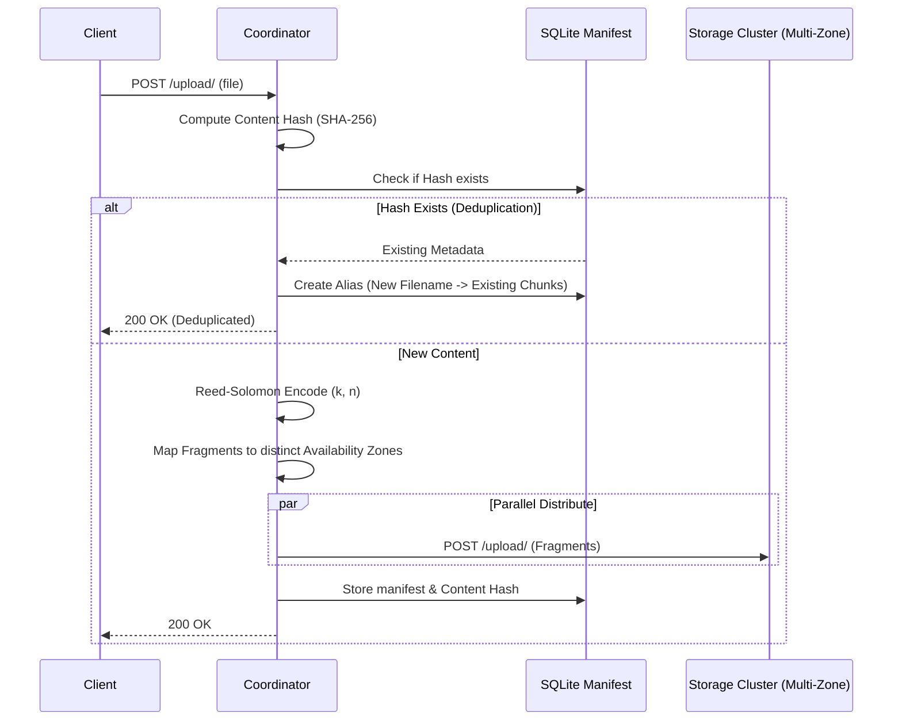
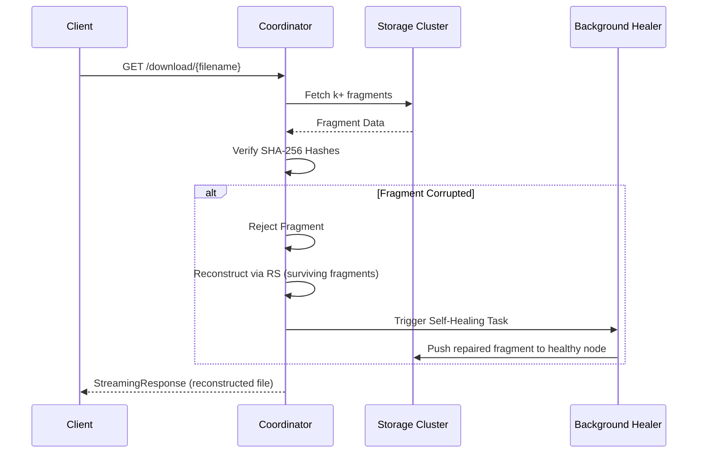

# Distributed Object Store with Integrity

[](https://github.com/YOUR_USERNAME/YOUR_REPO/actions/workflows/tests.yml)

A fault-tolerant, high-performance distributed storage system featuring **Generalized Reed-Solomon Erasure Coding**, **Merkle-style Deduplication**, and **Geo-Aware Topology Placement**. This system detects data corruption via SHA-256 integrity layers and automatically self-heals corrupted fragments in the background.

## Key Features

- **Custom Erasure Coding**: Manual implementation of Reed-Solomon over GF(2^8) using Vandermonde matrices. Support for dynamic $k$ and $n$.
- **Active Read-Repair**: Automatic background self-healing. When corruption is detected during a download, the system reconstructs the file and silently restores missing chunks to healthy nodes.
- **Merkle Deduplication**: Content-addressable storage logic. Identical files uploaded under different names share the same physical fragments, optimizing storage efficiency.
- **Geo-Aware Placement**: Fragments are distributed across multiple Availability Zones (`us-east-1a`, `us-east-1b`, etc.) to ensure the system survives entire data-center blackouts.
- **Dynamic Cluster Scaling**: Easily deploy a cluster of any size (3 to 256 nodes) with a single command.
- **Flash-Sale Aesthetic UI**: A monochromatic, high-contrast, utilitarian dashboard for real-time cluster monitoring and management.

## How It Works

### Upload Flow (with Deduplication & Geo-Spread)



### Download Flow (with Read-Repair)



## Quick Start

We use a `Makefile` to simplify operations:

```bash
# 1. Configure cluster for N nodes (e.g., 6 nodes)
make cluster nodes=6

# 2. Start the cluster (1 coordinator + 6 storage nodes)
make build

# 3. Run integration tests
make test

# 4. Interactive demo steps
make demo-upload
make demo-corrupt
make demo-download

# 5. Shut down and clean up
make clean
```

### Access the Dashboard
Once the cluster is running, open your browser to:
`http://localhost:8000/ui/`

## Project Structure

```
sec-dist-proj/
├── coordinator/
│   ├── main.py             # Brain: Deduplication, Geo-Placement, Self-Healing
│   ├── erasure_coding.py   # Engine: GF(2^8) Matrix Math (Reed-Solomon)
│   ├── static/index.html   # High-performance Dashboard
├── node/
│   ├── main.py             # Simple binary storage service
├── deploy_cluster.py       # Dynamic Docker-Compose generator
├── client.py               # CLI Interface
├── Makefile                # Command orchestrator
└── test_suite.py           # Integration testing
```

## Tech Stack

- **Python 3.10** / **FastAPI** / **Uvicorn**
- **SQLite** (Content-Hash Manifest)
- **Docker Compose** (Container Orchestration)
- **httpx** (Async Internal Communication)
- **Terraform** (AWS Infrastructure Ready)

## License

Apache 2.0
