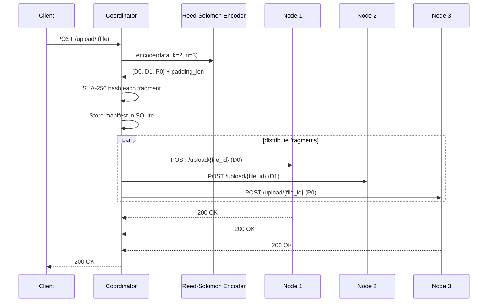
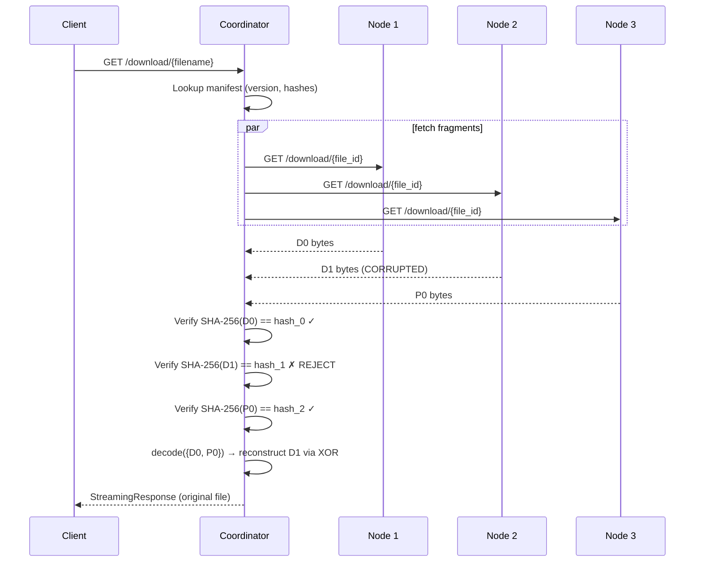
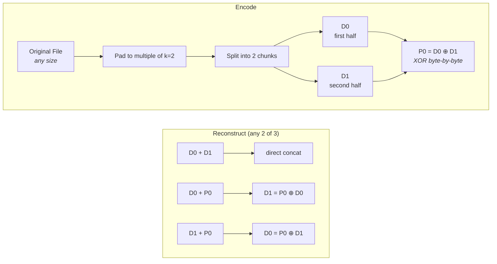
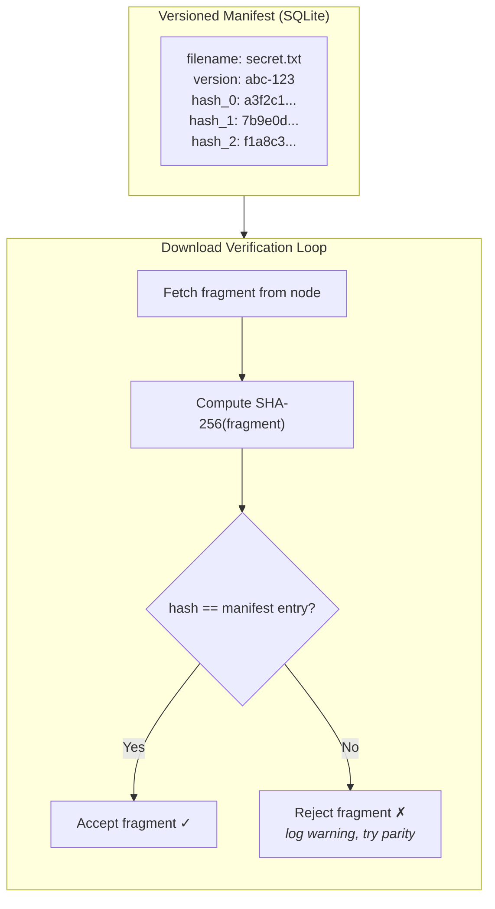
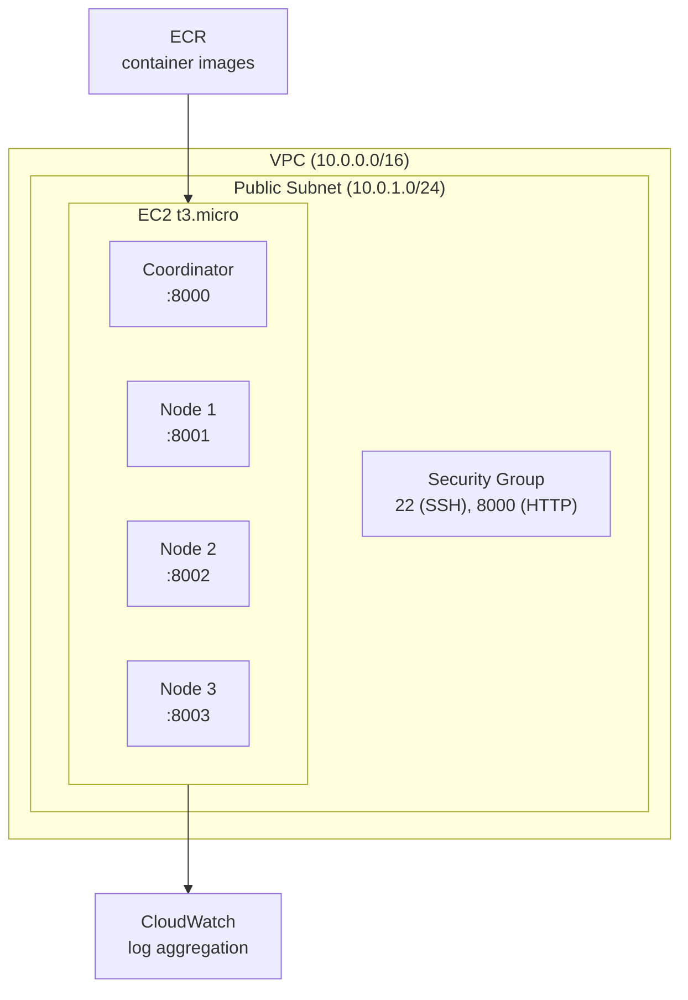

# Distributed Object Store with Integrity

A fault-tolerant distributed storage system that splits files across multiple nodes using custom Reed-Solomon erasure coding (k=2, n=3) and verifies fragment integrity with SHA-256 hashes to detect corruption and prevent "mix-and-match" attacks during reconstruction.

You can lose 1 out of 3 storage nodes and the file still comes back. You can corrupt a fragment on a surviving node and the system catches it before it ever touches the decoder.

## How It Works

### Upload Flow



### Download Flow (with corruption detection)



### Erasure Coding

The encoder splits each file into 2 data chunks and computes 1 parity chunk. In GF(2^8), addition is XOR, so parity = D0 ^ D1 byte-by-byte.



The Galois Field implementation uses primitive polynomial `x^8 + x^4 + x^3 + x^2 + 1` (0x11D) with precomputed log/antilog tables for fast arithmetic. This isn't just a library wrapping `pyreedsolomon` -- it's the actual field math built from scratch (`coordinator/erasure_coding.py`).

### Integrity Protocol

The problem this solves: if a file gets updated (v1 → v2), a stale node might still hold a v1 fragment. Blindly mixing fragments from different versions produces garbage.



Every fragment is cryptographically bound to a specific file version. A corrupted or stale fragment gets rejected before it ever reaches the decoder.

## Quick Start

```bash
# start the cluster (1 coordinator + 3 storage nodes)
docker-compose up --build

# in another terminal, upload a file
python client.py upload ./myfile.txt /docs/myfile.txt

# list stored files
python client.py list

# download it back
python client.py download /docs/myfile.txt ./downloaded.txt

# simulate node corruption (corrupts fragment on node 3)
python client.py corrupt 3 /docs/myfile.txt

# download again -- system detects corruption and reconstructs from remaining nodes
python client.py download /docs/myfile.txt ./downloaded_v2.txt
```

Or open `http://localhost:8000/ui/` for the web dashboard.

## Project Structure

```
sec-dist-proj/
├── coordinator/
│   ├── main.py                 # FastAPI service: upload, download, list, admin endpoints
│   ├── erasure_coding.py       # Custom Reed-Solomon over GF(2^8), k=2, n=3
│   ├── static/index.html       # Web dashboard
│   ├── Dockerfile
│   └── requirements.txt
├── node/
│   ├── main.py                 # FastAPI service: fragment storage (store/retrieve/delete/corrupt)
│   ├── Dockerfile
│   └── requirements.txt
├── client.py                   # CLI client (upload, download, list, corrupt)
├── test_suite.py               # Integration tests (healthy, single-corruption, double-corruption)
├── terraform/main.tf           # AWS infra (VPC, EC2, ECR, SG)
├── docker-compose.yml          # Local orchestration

```

## API Reference

### Coordinator (port 8000)

| Method | Endpoint | Description |
|--------|----------|-------------|
| `POST` | `/upload/` | Upload a file. Multipart form with `file` field. Optional `custom_filename` query param. |
| `GET` | `/download/{filename}` | Download a file. Fetches fragments, verifies hashes, decodes, streams back. |
| `GET` | `/list/` | List stored files. Optional `prefix` query param for filtering. |
| `POST` | `/admin/corrupt/{node_id}/{filename}` | Corrupt a fragment on a specific node (demo/testing). |
| `GET` | `/ui/` | Web dashboard. |

### Storage Nodes (port 8000 internally)

| Method | Endpoint | Description |
|--------|----------|-------------|
| `GET` | `/health` | Health check. |
| `POST` | `/upload/{file_id}` | Store a fragment binary. |
| `GET` | `/download/{file_id}` | Retrieve a fragment binary. |
| `DELETE` | `/delete/{file_id}` | Delete a fragment. |
| `POST` | `/corrupt/{file_id}` | Append garbage bytes to simulate corruption. |

## Running the Tests

The integration tests require the Docker Compose stack to be running:

```bash
docker-compose up --build -d
python test_suite.py
```

Three tests:

| Test | What It Does | Expected Result |
|------|-------------|-----------------|
| `test_01_upload_and_download_healthy` | Upload then download with all nodes up | File matches original |
| `test_02_single_corruption_resilience` | Corrupt fragment on 1 node, then download | System recovers using parity, file matches |
| `test_03_double_corruption_failure` | Corrupt fragments on 2 nodes, then download | HTTP 500 -- not enough valid fragments |

## Infrastructure

Terraform config (`terraform/main.tf`) provisions a minimal AWS environment:



All resources fit within the AWS Free Tier. Spin up for demos, tear down after:

```bash
cd terraform
terraform init
terraform plan
terraform apply
# ...demo...
terraform destroy
```

## Tech Stack

- **Python 3.10** / **FastAPI** / **Uvicorn** -- services
- **httpx** -- async HTTP between coordinator and nodes
- **SQLite** -- metadata and fragment hash manifest
- **Docker Compose** -- local orchestration
- **Terraform** -- AWS infrastructure as code
- **Vanilla HTML/CSS/JS** -- web dashboard (no framework overhead)

## License

Apache 2.0
